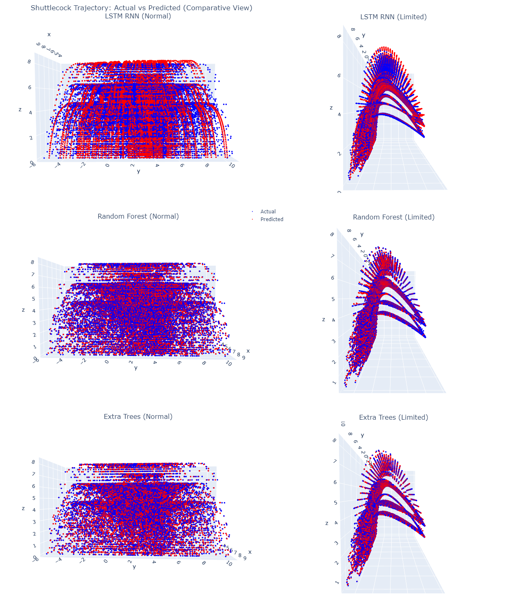
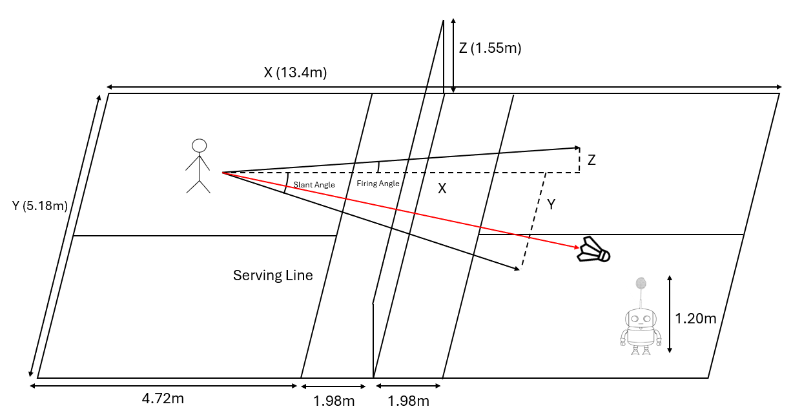
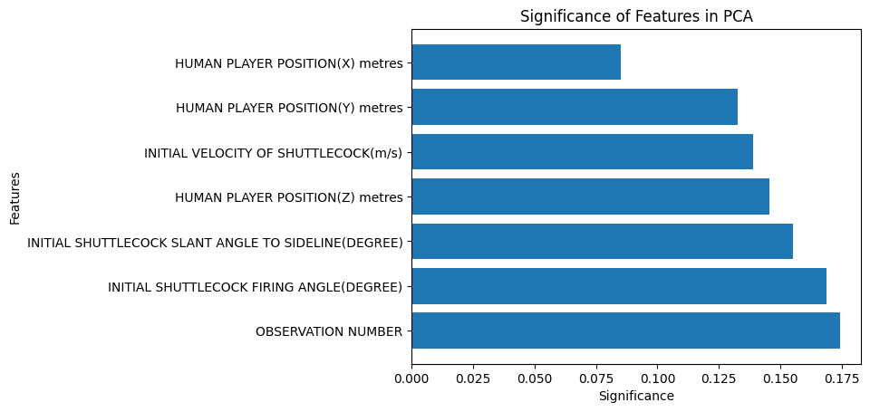
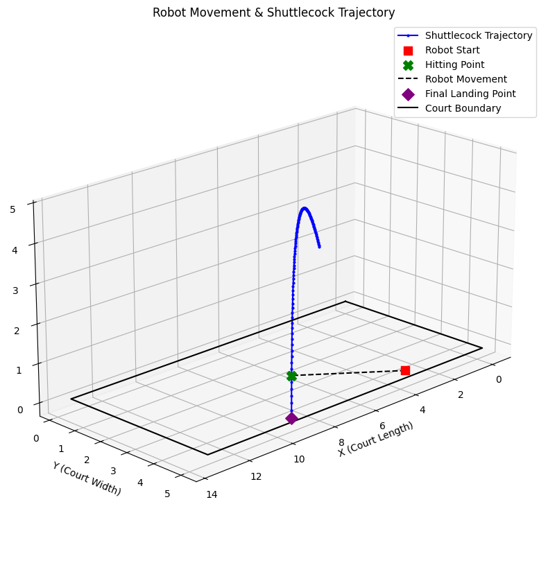
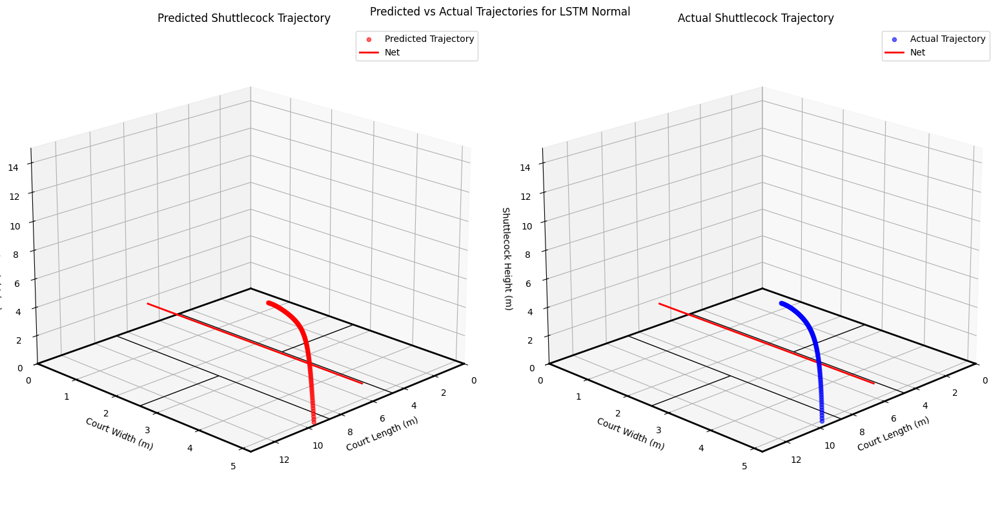
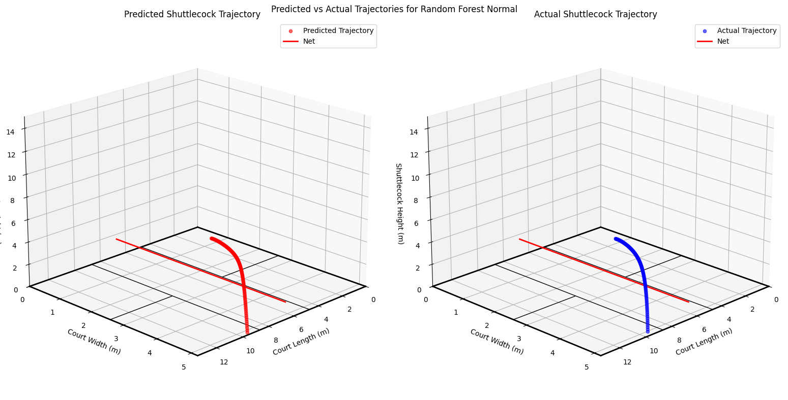

# Shuttlecock Trajectory Estimation

## Overview
This project explores the forecasting of trajectories of a shuttlecock in a badminton game using machine learning models. By leveraging motion capture data, the goal is to predict the shuttlecock’s flight path based on initial conditions such as player position, shuttlecock velocity, and firing angles. The project explores different models, including Decision Trees, Random Forest, Extra Trees, and LSTMs, to evaluate their effectiveness in trajectory prediction. Results of this project can be used to enhance automated badminton training systems and robotic by anticipating where the shuttlecock will land.

## Dataset

The dataset used in the project consisted of shuttlecock trajectory records captured from multiple badminton games scenarios. Each observation included:
- Player Position (X, Y)(m)
- Initial Velocity of Shuttlecock (m/s)
- Initial Shuttlecock Firing Angle (°)
- Initial Shuttlecock Slant Angle to Sideline (°)
- Shuttlecock position in Air (X, Y, Z)(m)

Each of the dimensions represents
- X - With respect to the length of the court
- Y - With respect to the width of the court
- Z - with respect to the height of the court

### Data Processing
- Removal of rows containing all blanks or zeros
- Correction of certain column names and spelling errors
- Normalisation and reshaping of X features exclusively for the LSTM RNN model

### Feature Enrichment
Was done to enhance the dataset for better model learning, thus creating the following features:
- **HUMAN PLAYER POSITION(Z)**: Human starting height position with respect to the badminton court. 
- **Observation Group Number**: Each group of shuttlecock sequences belong to the same shuttlecock trajectory are assigned an observation group number, grouping these shuttlecock sequences together.  
- **Observation Number**: Indicates the order of the sequence within each observation group, helping models learn temporal dependencies. 

### Creation of Two Datasets
To meet the project’s requirement of conducting predictions using both all original features and a limited feature set, we created two datasets. The original dataset retains all provided features, while the other (limited) uses only the shuttlecock’s X, Y, and Z coordinates for trajectory prediction.

#### Limited Datasets
- Drops all non-positional shuttlecock features (velocity, angles, player positions)
- Uses only shuttlecock's (X, Y, Z) positions
- Requires data enrichment to get observation group numbers, observation numbers
- Requires deriving trajectory-based features by computing velocity and acceleration from sequential shuttlecock positions.


To ensure that features, were relevant to the project, PCA component was used to calculate each X feature's relative contribution to the output. 

## Model Explored
The project tested multiple machine learning models for trajectory estimation:
- Decision Tree Model – Predicts the number of observations (sequence length).
- Random Forest Regressor – Estimates shuttlecock trajectory using all available features.
- Extra Trees Regressor – Similar to Random Forest but with more randomized splits.
- LSTM-RNN – Captures temporal dependencies to predict the next shuttlecock position over time.


### Training Approaches
Approaches experimented with when training models involved
- Random row (data points randomly assigned to train-test) VS observation group (trajectory sequence remains intact) splits
- Different depths or n-estimators (regression models)
- Different number of neuron units in layers (neural network models)
- Limited vs Normal datasets

### Evaluation
Was conducted for each model by comparing the predicted and actual trajectory using metrics:

- Mean Absolute Error (MAE)
- Mean Squared Error (MSE)
- Root Mean Squared Error (RMSE)
- Visual Trajectory Comparison (3D plots)

## Key Findings
### Graph and Statistics
```
                     Model       MAE       MSE      RMSE
0        LSTM RNN (Normal)  0.024958  0.003760  0.061321
1       LSTM RNN (Limited)  0.018069  0.002312  0.048082
2   Random Forest (Normal)  0.013691  0.000592  0.024340
3  Random Forest (Limited)  0.013691  0.000592  0.024340
4     Extra Trees (Normal)  0.004741  0.000104  0.010203
5    Extra Trees (Limited)  0.004741  0.000104  0.010203
```
- **Extra Trees Regressor** was the best performing model with the lowest mean absolute (0.004741), mean squared (0.000104) and root mean squared error (0.010203). 
- Limited datasets had little to no negative impact on performance, with identical performance for regression models and increase performance for the LSTM RNN model, suggesting the derived features did well in contributing towards correct shuttlecock predictions. 
- **LSTM RNN** surprisingly had the worst performance, despite its ability to model sequential dependencies. 

## Robot Implementation

The robot response system was designed to evaluate whether a robot could successfully predict the shuttlecock's trajectory given a single observation, and figure out the necessary steps to return it. This involved:


- Predicting the number of sequences within the shuttlecock's trajectory
- Predicting the shuttlecock's trajectory itself
- Checking if the shuttlecock lands within the court
- Checking which trajectory sequence is closest to the robot's hitting height
- Calculating the displacement between the robot's position and that target position
- Determining if the robot will be able to reach the shuttlecock given its speed.

Some single trajectories of various models:




## Conclusion
This project successfully developed a shuttlecock trajectory estimation system capable of predicting shuttlecock flight paths using multiple machine learning models. The Extra Trees Regressor consistently outperformed other models in accuracy, making it the most reliable option for shuttlecock prediction.

Key takeaways from the study include:
- Tree-based models (Extra Trees, Random Forest) outperformed LSTM RNN, achieving the lowest errors in trajectory estimation.
- Feature reduction (Limited dataset) did not negatively impact model performance with the derived features, making the approach viable even with reduced data.
- The robot response system demonstrated feasibility in predicting shuttlecock landings and computing movement strategies
## Installation Guide
### 📌 Prerequisites
 To ensure compatibility with packages, use **Python 3.11.1** before proceeding.

### 🔧 Virtual Environment Setup
This project uses **virtualenv** to manage dependencies.
#### Install virtualenv
```
pip install virtualenv
```
#### Create a Virtual Environment
```
virtualenv dependencies
```
#### Activate the Virtual Environment
```
./dependencies/Scripts/activate
```
#### Download the dependencies
```
pip install -r requirements.txt
```
#### To deactivate the virtual environment
```
deactivate
```
If you encounter an error "...\dependencies\Scripts\activate.ps1 cannot be loaded because running scripts is disabled on system" enter this to enable running of scripts on the system. 
```
Set-ExecutionPolicy RemoteSigned -Scope CurrentUser
```

## Project Structure & Auto Setup
This project is structured as follows:
```
📂 CSC3005-Shuttlecock-Trajectory-Estimation
│── 📂 data/                  # Contains raw, cleaned, and processed datasets
│── 📂 images/                # Stores generated plots and visualizations
│── 📂 models/                # Stores model training scripts
│   ├── 📂 notebook/          # Stores notebooks used for model exploration and evaluation
│   ├── 📂 trained_models/    # Stores trained model files (ignored by .gitignore)
│── 📂 preprocessing/         # Scripts for data preprocessing
│── 📂 dependencies/          # Virtual environment (ignored by .gitignore)
│── 📜 main.py                # Automates preprocessing & model training
│── 📜 requirements.txt       # Dependency list
│── 📜 README.md              # Project documentation
│── 📜 .gitignore             # Prevents large files from being pushed to GitHub
```

### 🚀 Auto-Run Setup
#### To process data and train all models in one step, simple run:
```
python main.py
```
## 🛠 Additional Notes
- Trained models are stored in **models/trained_models/** and ignored by Git to prevent large file uploads.
- Ensure **requirements.txt** is installed within the virtual environment to avoid dependency issues.
- If using Windows, be sure to enable script execution (**Set-ExecutionPolicy RemoteSigned -Scope CurrentUser**) before activating the virtual environment.

## Special Thanks to
- Matthew Chuang
- Roy Byun Min Sik
- Pang Jing Jie

For the sleepless nights spent. 
